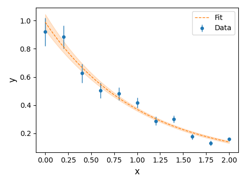

# LikeFit

LikeFit is an open-source library to fit data in science and engineering. 
It provides a simple yet complete interface to SciPy that performs linear and nolinear least squares and other likelihood fits. 

## Install

```sh
python -m pip install likefit
```

## Features
  * Linear and nonlinear least squares fits
  * Poisson likelihood to fit histograms
  * Binomial likelihood 
  * Calculation of estimators, errors, and correlations
  * Evaluation of goodness-of-fit with chi-squared test
  * Support for plotting error bands, confidence ellipses, and likelihood functions

## How to use

### Nonlinear least squares

Example of fitting data with a nonlinear least squares method

```py
import numpy as np

import likefit

xdata = np.array([0., 0.2, 0.4, 0.6, 0.8, 1., 1.2, 1.4, 1.6, 1.8, 2.])
ydata = np.array([0.92, 0.884, 0.626, 0.504, 0.481, 0.417, 0.288, 0.302, 0.177, 0.13, 0.158])
ysigma = np.array([0.1, 0.082, 0.067, 0.055, 0.045, 0.037, 0.03, 0.025, 0.02, 0.017, 0.014])


# Fit model must be vectorized in x
def fit_model(x, par):
    return par[0] * np.exp(par[1] * x)

# Create a least squares fitter and inititalize it with the data and the fit model
fitter = likefit.LeastSquares(xdata, ydata, ysigma, fit_model)

# Fit the data
seed = np.array([0, 0])
fitter.fit(seed)

print(f"Estimators: {fitter.get_estimators()}")
print(f"Errors: {fitter.get_errors()}")
print(f"Covariance matrix: {fitter.get_covariance_matrix()}")
print(f"Correlation matrix: {fitter.get_correlation_matrix()}")
print(f"Deviance: {fitter.get_deviance()}")
print(f"Degrees of freedom: {fitter.get_ndof()}")
print(f"Pvalue: {fitter.get_pvalue()}")
```

Plotting the fit and the error band

```py
# Plot
import matplotlib.pyplot as plt

fig, ax = plt.subplots()
ax.set_xlabel("x")
ax.set_ylabel("y")

# Plot data
ax.errorbar(fitter.x, fitter.y, fitter.ysigma, ls='none', marker='o', label="Data")

# Plot fit
xfit = np.linspace(start=xdata.min(), stop=xdata.max(), num=100)
yfit = fitter.get_yfit(xfit)
ax.plot(xfit, yfit, ls='--', label="Fit")

# Plot error band
yfit_error = fitter.get_yfit_error(xfit)
ax.fill_between(xfit, yfit - yfit_error, yfit + yfit_error, color='tab:orange', alpha=0.2)

plt.legend()
plt.tight_layout()
plt.show()
```




### Linear least squares

Support of linear least squares fits with a similar interface to the nonlinear case.

```py
import numpy as np

import likefit

xdata = np.array([1.02, 1.06, 1.1, 1.14, 1.18, 1.22, 1.26, 1.3, 1.34])
ydata = np.array([2.243, 2.217, 2.201, 2.175, 2.132, 2.116, 2.083, 2.016, 2.004])
ysigma = np.array([0.008, 0.008, 0.01, 0.009, 0.011, 0.016, 0.018, 0.021, 0.017])
npar = 2


# Model linear in the parameters 
def fit_model(x, par):
    return par[0] + par[1] * (x - 1.2)


fitter = likefit.LinearLeastSquares(xdata, ydata, ysigma, npar, fit_model)
fitter.fit()  # Seed not needed
```

### Poisson

The example below fits a normal distribution to a histogram

```py
import numpy as np
from scipy.stats import norm

import likefit

xdata = np.linspace(start=-2.9, stop=2.9, num=30)
nevents = np.array([0, 2, 5, 8, 7, 18, 15, 27, 34, 51, 55, 63, 67, 75, 90, 78, 73, 70, 62, 51, 33, 26, 30, 17, 15, 14, 5,
                  4, 1, 0])


# fit_model vectorized in x
def fit_model(x, par):
    return par[0] * norm.pdf(x, loc=par[1], scale=par[2])


fitter = likefit.Poisson(xdata, nevents, fit_model)
seed = np.array([1, 0, 1])
fitter.fit(seed)
```

### Binomial

Fit efficiency data with a sigmoid function

```py
import numpy as np

import likefit

xdata = np.arange(start=0.05, stop=1.05, step=0.05)
ntrials = np.full(xdata.shape, 30)
nsuccess = np.array([0, 0, 0, 3, 3, 2, 8, 5, 4, 11, 18, 15, 19, 20, 26, 24, 26, 29, 30, 30])


# fit_model is sigmoid function vectorized in x
def fit_model(x, par):
    return 1 / (1 + np.exp(-(x - par[0]) / par[1]))


fitter = likefit.Binomial(xdata, ntrials, nsuccess, fit_model)
seed = np.array([0.5, 1])
fitter.fit(seed)
```

## Contributing
If you'd like to contribute, please fork the repository and use a feature
branch. Pull requests are warmly welcome.

## Links
- Repository: https://github.com/ravignad/likefit/

## Licensing
The code in this project is licensed under MIT license.

